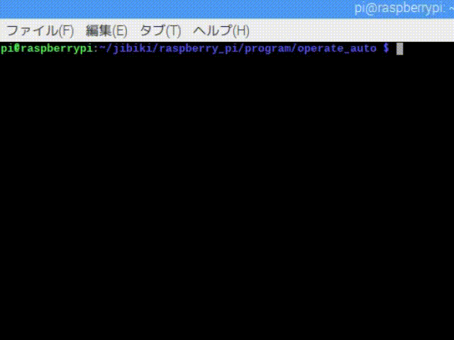

# jibiki::ProcOperateAuto
[戻る](overview.md/#jibikiProcOperateAuto)

# 概要
* 実行したい動作一つ一つを `order`，以下の４つを１セットとして複数まとめたものを `orders` と呼んでいる．
    * `name`（名前）
    * `seq`（接続関係）
    * `mode`（実行する `order`）
    * `param`（パラメータ）
* `order` の例
    * サーボモータを指定した角度まで動かす（servo）．
    * 接地エンコーダから得たオドメトリをもとに，指定した位置まで移動する（odometry）．
    * 車体を回転（方向転換）させる（turn）．
    * リミットスイッチが押されるまで移動する（limit）．
    * 昇降機構を指定した位置まで移動させる（rot）．
    * 指定した回転数でモータを駆動する（rev）．
    * 電磁弁を開閉する（solenoid）．
    * 指定した時間待機する（wait）．
* [`orders` の例](spec_proc_operate_auto_orders.md)
* `order` は関数として実装し，`jibiki::ProcOperateAuto` のオブジェクトを作成するときに渡す．
* `jibiki::ProcOperateAuto` は JSON ファイルに記述した `orders` を読み込み，読み込んだ `orders` に従って指定された関数を指定されたタイミングで呼び出す．

# JSON ファイルの準備
* `setting.json` と `order.json` の２つが必要．
* プログラムをビルドした際に生成される実行ファイルと同じディレクトリに配置する．
### setting.json
* 以下の例のように [`jibiki::thread ::enable`](../_thread/spec_thread.md/#jibikithread-enable) に必要とされる項目を記載．
* `"thread"` と `"operate_auto"` は固定．
```JSON
{
    "thread":
    {
        "operate_auto": true
    }
}
```
### order.json
* `mode_list` と `orders` を記載する．
    * `mode_list` には `order` の処理を行う関数を表す文字列を記載する．
    * `mode_list` に記述する文字列の順番は，`jibiki::ProcOperateAuto` のオブジェクト作成時に渡す `order` の関数の順番と対応させる．
    * `orders` は複数個記載してよい（`orders` の名前は重複しないようにする）．
* `orders` は[これ](spec_proc_operate_auto_orders.md/#ordersJSON-ファイルで表現)，`mode_list` は[これ](spec_proc_operate_auto_orders.md/#mode_list)を参考にする．
```
{
    "mode_list": [
        "odometry",
        "turn",
            ...
    ],
    "nanndemo_ii_namae1":[
        /* orders */
    ],
    "nanndemo_ii_namae2":[
        /* orders */
    ]
}
```
# ヘッダファイル
```C++
#include "../../share/inc/_utility.hpp"
```
# ModeFunc の準備
* `order` の処理を行う関数を `ModeFunc` と呼んでいる．
* `ModeFunc` の例を以下に示す．
```C++
void test(jibiki::ProcOperateAuto *control,
          std::vector<std::string> param,
          size_t seq[])
{
    /* パラメータ読み込み */
    size_t wait_time = std::stoi(param[0]);

    /* 指定時間待機 */
    for (size_t i = 0; i < wait_time; ++i)
    {
        /* スレッドの管理 */
        if (!control->manage_thread_int())
            break;

        /* 待機 */
        usleep(1E6);
    }
}
```
* `ModeFunc` の戻り値の型は `void`，仮引数は `(jibiki::ProcOperateAuto *control, std::vector<std::string> param, size_t seq[])` にする．
    * JSON ファイルに記載した `param` の値は，`ModeFunc` の仮引数 `param` に渡される．
    * `std::stoi` は文字列を整数に変換する関数（実数に変換する場合は `std::stod` を使う）．
* `ModeFunc` は一つ一つが別スレッドで実行されるため，`ModeFunc` 内のループでは `jibiki::thread::manage` を呼び出さないとスレッドの管理（終了，一時停止）がうまく行かない．
    * `ModeFunc` 中では `jibiki::thread::manage` の代わりに `jibiki::ProcOperateAuto::manage_thread_int` を使う．

# オブジェクトの作成
```C++
ProcOperateAuto(ShareVal<bool> &exit_flag,
                ShareVal<bool> &start_flag,
                ShareVal<bool> &reset_flag,
                ShareVal<thread::OperateMethod> &current_method,
                ShareVal<std::string> &execute_orders,
                ShareValVec<std::string> &executing_order,
                std::vector<ModeFunc> mode_func,
                bool is_print = false,
                std::string json_path = "order.json");
```
|引数名|説明|
|:-|:-|
|exit_flag|終了フラグ．<br>`true` になったらスレッドを終了する．|
|start_flag|開始フラグ．<br>`start_flag == true && reset_flag == false` になったら `orders` を読み込み，実行する．|
|reset_flag|リセットフラグ．<br>`orders` の実行中に `true` になったら `orders` の処理を中断し，初期状態に戻る．|
|current_method|現在使用している操作方法．<br>値が `jibiki::thread::OPERATE_AUTO` 以外のときは処理を一時停止する．|
|execute_orders|実行する `orders` を指定する．<br>`order.json` に記述した `orders` の名前のいずれかを指定する．|
|[executing_order](#executing_order-について)|`ModeFunc` 内から文字列を指定し，実行中の `order` に関する情報をクラス外部に渡すために用いる．|
|mode_func|`ModeFunc` の関数をリストで指定する．<br>記載する関数の順番は `order.json` の `mode_list` の順番と対応させる．|
|is_print|`true` を指定することで，`orders` を読み込んだ際に内容を出力するようになる．|
|json_path|`orders` を記載した JSON ファイルのパスを指定する．<br>省略した場合は `order.json` になる．|

例）
```C++
jibiki::ProcOperateAuto proc_operate_auto(std::ref(exit_flag),
                                            std::ref(start_flag),
                                            std::ref(reset_flag),
                                            std::ref(operate_method),
                                            std::ref(execute_orders),
                                            std::ref(executing_order),
                                            {test1,
                                            test2,
                                            test3});
```

# executing_order について
* 実行中の `ModeFunc` からクラス外部へ渡す任意の文字列を `executing_order` と呼んでいる．
* `executing_order` を使うことで次のように `ModeFunc` 実行中の情報を別のスレッドから表示することができる．


* `executing_order` を管理するために以下の二つのメンバ関数が用意されている．
    * `jibiki::ProcOperateAuto::set_executing_order`：`executing_order` に文字列を追加する．
    * `jibiki::ProcOperateAuto::clear_executing_order`：`executing_order` をクリア（初期化）する．
* 以下に例を示す．
    * `control`，`seq` には `ModeFunc` の仮引数を使う．
    ```C++
    control->set_executing_order(seq, "string");
    control->clear_executing_order(seq);
    ```

# サンプル
* `jibiki::ProcOperateAuto` を用いたプログラムのサンプルは本リポジトリの [`program/operate_auto`](../../program/operate_auto) にある．
* 解説は長いため[別ページ](spec_proc_operate_auto_sample.md)
# 関連
* [jibiki::ShareVal](../_thread/overview.md/#jibikiShareVal)
* [jibiki::ShareValVec](../_thread/overview.md/#jibikiShareValVec)
* [jibiki::thread ::manage](../_thread/spec_thread.md/#jibikithread-manage)
* [jibiki::thread ::enable](../_thread/spec_thread.md/#jibikithread-enable)